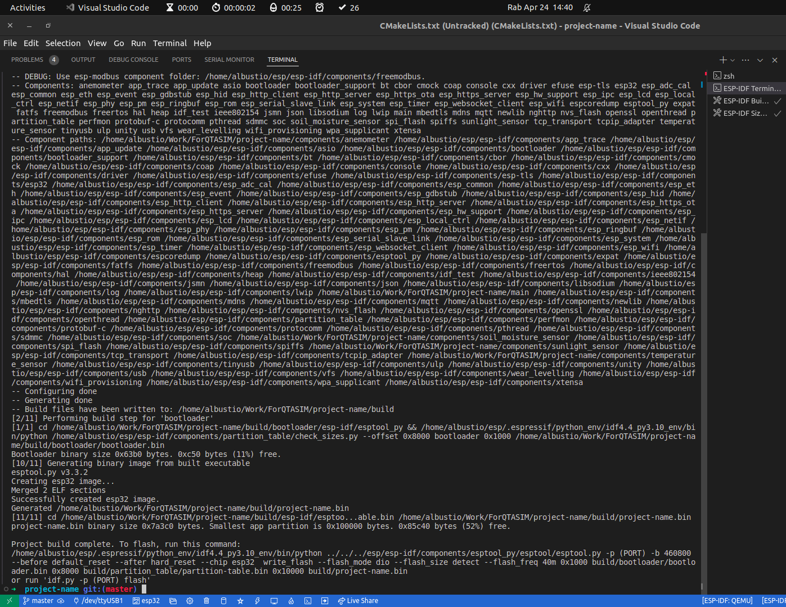

# IoT Sensor Data Post

This project is designed to read data from various sensors, format the data into a JSON payload, and post the payload to a specific URL every minute. The project is built for the ESP32 microcontroller using the ESP-IDF libraries and FreeRTOS.

## Sensors

The project reads data from the following sensors:

- Soil Moisture Sensor: Measures the moisture level of the soil.

- Air Temperature Sensor: Measures the temperature of the air.

- Anemometer (Wind Speed Sensor): Measures the speed of the wind.

- Sunlight Sensor: Measures the intensity of sunlight.

## Data Posting

The sensor data is posted to the following URL: `https://cisea.bukitasam.co.id/api-iot/api/v1/iot/iot-test/post`

The data is posted in the following JSON format:

```json

{

   "sensor_code":"FF-001",

   "location":"Blok Timur A",

   "timestamp":"2023-09-11 10:30:00",

   "data":{

      "soil_moisture":45.6,

      "air_temperature":28.2,

      "wind_speed":5.4,

      "sunlight_intensity":750

   }

}
```

## FreeRTOS

The project uses FreeRTOS to create a task that reads the sensor data, formats the JSON payload, and posts the payload every minute. The task is pinned to core 1 of the ESP32.

## Building and Running

To build the project, navigate to the project directory and run the following command:

`idf.py build`

To flash the project onto the ESP32, connect the ESP32 to your computer and run the following command:

`idf.py -p PORT flash`

Replace `PORT` with the port that the ESP32 is connected to.

To view the output of the ESP32, run the following command:

`idf.py -p PORT monitor`

Replace `PORT` with the port that the ESP32 is connected to.

## Note

- The Project use hardware dummies, ie using some sort of mocked class to simulate the hardware
- all the sensor class use the esp-idf paradigm components to seperate HAL code or userinterface codes
- the **code can be build** 
- it used esp-idf release/v4.4
- 

## esp-idf instalation
- head to this url for esp-idf instalation : https://docs.espressif.com/projects/esp-idf/en/stable/esp32/get-started/index.html
- 